# 🎓 Майстер-клас: Архітектура Entity Framework Core 10 від А до Я

> **Інтерактивна презентація-посібник** для розробників та архітекторів.  
> Проєкт побудований на базі курсу [metanit — Entity Framework Core](https://metanit.com/sharp/efcore/) і трансформований у живу навчальну систему на базі .NET 10 та Web API.

---

<a id="toc"></a>
## 📑 Зміст майстер-класу

- [Слайд 1. Що таке EF Core та сучасний підхід до даних (Аналогія перекладача)](#slide-1)
- [Слайд 2. Архітектурний вибір: ADO.NET vs Dapper vs EF Core](#slide-2)
- [Слайд 3. Анатомія DbContext: Unit of Work та Repository в одному об'єкті](#slide-3)
- [Слайд 4. Життєвий цикл ChangeTracker: Як EF Core бачить зміни](#slide-4)
- [Слайд 5. Управління схемою: EnsureCreated проти Migrate (Смертельна пастка)](#slide-5)
- [Слайд 6. Провайдери СУБД: Абстракція ядра від діалектів баз даних](#slide-6)
- [Слайд 7. Стійкість підключень: Connection Resiliency & Retry Strategies](#slide-7)
- [Слайд 8. Моделювання даних: Data Annotations проти Fluent API](#slide-8)
- [Слайд 9. Ключі, індекси та обмеження цілісності (Alternate Keys & Filtered Indexes)](#slide-9)
- [Слайд 10. Генерація значень та інкапсуляція: Computed Columns & Backing Fields](#slide-10)
- [Слайд 11. Зв'язки між сутностями: One-to-Many та One-to-One](#slide-11)
- [Слайд 12. Many-to-Many та ієрархічні структури (Self-Referencing)](#slide-12)
- [Слайд 13. Value Objects у реляційній БД: Owned Types проти Complex Types](#slide-13)
- [Слайд 14. Каскадні операції: Cascade, SetNull, Restrict (Безпека видалення)](#slide-14)
- [Слайд 15. Стратегії завантаження: Eager, Explicit, Lazy Loading та проблема N+1](#slide-15)
- [Слайд 16. Успадкування в реляційній СУБД: Стратегія TPH (Table Per Hierarchy)](#slide-16)
- [Слайд 17. Успадкування: Стратегії TPT (Table Per Type) та TPC (Table Per Class)](#slide-17)
- [Слайд 18. Анатомія LINQ: IEnumerable проти IQueryable (Межа "БД vs Пам'ять")](#slide-18)
- [Слайд 19. Оптимізація читання: AsNoTracking та Identity Resolution](#slide-19)
- [Слайд 20. Глобальні фільтри запитів: Soft Delete та Multi-Tenancy](#slide-20)
- [Слайд 21. Масові операції: ExecuteUpdate та ExecuteDelete](#slide-21)
- [Слайд 22. Гібридний підхід: FromSql, збережені функції (UDF) та процедури](#slide-22)
- [Слайд 23. Оптимістичний паралелізм: Токени RowVersion та гонки даних](#slide-23)
- [Слайд 24. Машина часу: Темпоральні таблиці SQL Server та Скомпільовані запити](#slide-24)
- [Слайд 25. Зведена шпаргалка архітектора: Чекліст підготовки до Production](#slide-25)

---

<a id="slide-1"></a>
### Слайд 1. Що таке EF Core та сучасний підхід до даних (Аналогія перекладача)

#### 1. Що це таке простими словами (Життєва аналогія)
Уявіть дипломатичні переговори, де делегат говорить виключно об'єктно-орієнтованою українською мовою (класи, екземпляри, посилання на інші об'єкти), а співрозмовник — суворою реляційною мовою SQL (рядки, стовпці, зовнішні ключі, таблиці). **Entity Framework Core — це висококласний перекладач-синхроніст (Object-Relational Mapper, ORM)**. Ви висловлюєте наміри звичними мовними конструкціями C#, а перекладач транслює їх у вивірені команди СУБД, враховуючи діалект конкретної бази.

#### 2. Яку проблему це вирішує?
У наївному підході розробник змушений вручну писати SQL-запити у рядкових літералах C#, відкривати з'єднання, створювати `SqlCommand`, передавати параметри, по рядку зчитувати `SqlDataReader` та мапити кожен стовпець `reader["Name"].ToString()`. При перейменуванні стовпця помилка виявиться лише у Runtime під час виконання запиту клієнтом.

#### 3. Порівняльна таблиця: Наївний підхід vs Сучасний EF Core
| Критерій | Наївний підхід (Ручний ADO.NET) | EF Core (Сучасний підхід) |
|---|---|---|
| **Типобезпека** | Відсутня (SQL у лапках `string`, помилки в рантаймі) | 100% Compile-Time перевірка через C# типи та LINQ |
| **Мапінг даних** | Ручне вичитування кожного стовпця з `IDataReader` | Автоматична матеріалізація у строго типізовані моделі |
| **Зміна моделі** | Потребує ручного пошуку десятків текстових SQL-файлів | Зміна C# класу + автогенерація міграції через CLI |
| **Відстеження змін** | Ручне формування UPDATE-запитів для кожного поля | `ChangeTracker` фіксує лише змінені поля сутності |

#### 4. Архітектурні переваги
- **Швидкість розробки (Time-to-Market)**: Сфокусованість на бізнес-моделі замість написання одноманітного інфраструктурного бойлерплейту.
- **Відсутність людського фактора**: Захист від друкарських помилок у назвах полів та структурі зв'язків.

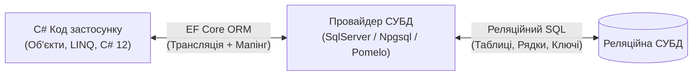

👉 **Пов'язаний код у проєкті:**
- [User.cs](../Chapter01_Introduction/Models/User.cs) 📍 *(дивіться рядки 6–11 — проста POCO-сутність)*
- [IntroductionContext.cs](../Chapter01_Introduction/IntroductionContext.cs) 📍 *(дивіться рядки 11–18 — визначення DbSet)*

---
[⬅ Попередній слайд](#toc) • [⬆ До змісту](#toc) • [Наступний слайд ➡](#slide-2)

---

<a id="slide-2"></a>
### Слайд 2. Архітектурний вибір: ADO.NET vs Dapper vs EF Core

#### 1. Що це таке простими словами (Життєва аналогія)
- **ADO.NET** — це керування кожним гвинтиком механічного верстата вручну. Повний контроль, але величезний ризик помилитися при кожному русі.
- **Dapper (Micro-ORM)** — швидкий спортивний мотоцикл. Він просто підкидає вас до мети (швидко виконує готовий SQL і мапить результат у класи), але будувати маршрут (писати складні SQL) ви повинні самі.
- **EF Core (Повнофункціональний ORM)** — сучасний електромобіль із круїз-контролем та автопілотом. Він сам прокладає шлях, відстежує витрату заряду (зміни в пам'яті), оптимізує маршрут і паркується (відкриває транзакції).

#### 2. Яку проблему це вирішує?
Вибір неправильного інструменту призводить або до перевантаження системи рутинним кодом (ADO.NET), або до втрати бізнес-моделювання та системи міграцій (чистий Dapper), або до перевантаження пам'яті важким ORM там, де потрібне лише надшвидке читання.

#### 3. Порівняльна таблиця інструментів
| Характеристика | ADO.NET | Dapper | Entity Framework Core 10 |
|---|---|---|---|
| **Швидкість читання** | Базова (найвища) | Майже на рівні ADO.NET | 95-98% від швидкості Dapper (при `AsNoTracking`) |
| **Unit of Work & Change Tracking** | Немає | Немає | Повноцінний вбудований |
| **Генерація SQL** | Лише вручну | Лише вручну | Автоматична з LINQ (+ підтримка сирого SQL) |
| **Міграції схеми** | Вручну / сторонні інструменти | Вручну / сторонні інструменти | Вбудовані потужні міграції (`dotnet ef`) |
| **Вартість підтримки коду** | Дуже висока | Середня | Низька |

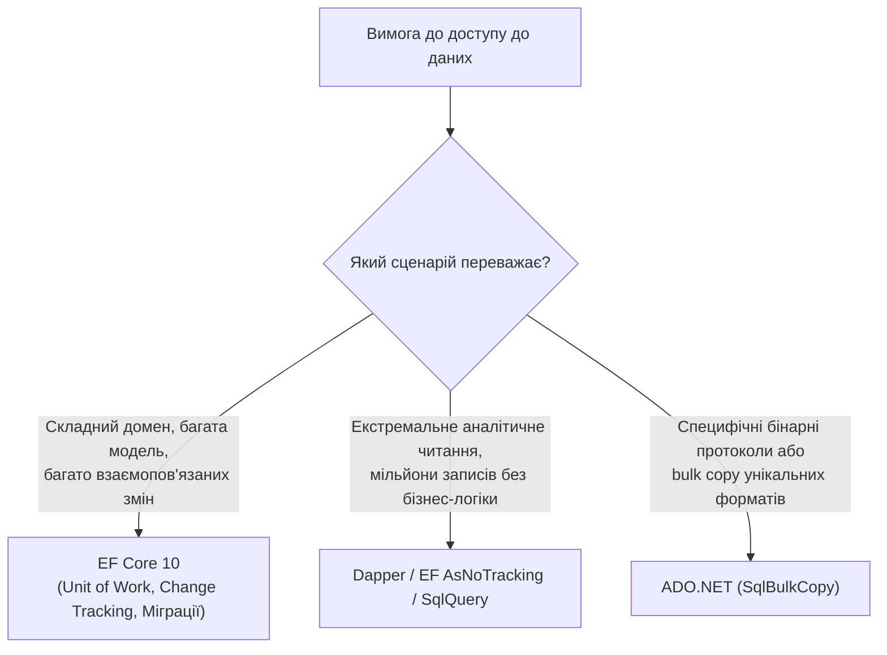

👉 **Пов'язаний код у проєкті:**
- [FirstAppController.cs](../Chapter01_Introduction/Controllers/FirstAppController.cs) 📍 *(дивіться рядки 18–45 — елегантний CRUD без єдиного рядка SQL)*

---
[⬅ Попередній слайд](#slide-1) • [⬆ До змісту](#toc) • [Наступний слайд ➡](#slide-3)

---

<a id="slide-3"></a>
### Слайд 3. Анатомія DbContext: Unit of Work та Repository в одному об'єкті

#### 1. Що це таке простими словами (Життєва аналогія)
Уявіть похід до великого супермаркету. Ви берете візок (**DbContext**). На поличках лежать товари різних категорій (**`DbSet<T>`** — ваші репозиторії). Ви кладете товари у візок, деякі міняєте на свіжіші, інші повертаєте назад. Ніякі гроші з вашого рахунку не списуються і касовий чек не друкується, поки ви не підійдете до каси й не натиснете "Оплатити" (**`SaveChanges()`**). `SaveChanges` — це ваш фіскальний чек, що оформлює всю покупку як єдину неподільну транзакцію.

#### 2. Яку проблему це вирішує?
Без патерну Unit of Work кожна операція над окремою таблицею вимагала б відкриття власної транзакції. Якщо створення замовлення вдалося, а списання товару зі складу впало з помилкою — база даних опиняється в розсинхронізованому стані (гроші знято, товару немає).

#### 3. Порівняльна таблиця підходів
| Наївне проектування | Архітектурний підхід EF Core |
|---|---|
| Створення 10 окремих інтерфейсів `IUserRepository`, `IOrderRepository`, де кожен робить свій `Commit()` | `DbContext` координує всі сутності та фіксує їх одним атомарним викликом `SaveChangesAsync()` |
| Штучне обгортання `DbContext` у власні беззмістовні класи `UnitOfWork` | Розуміння того, що `DbContext` вже сам по собі реалізує патерни Unit of Work та Generic Repository |
| Окреме відкриття та закриття SQL-транзакцій вручну | Автоматичне обгортання всіх змін з `SaveChanges()` в одну транзакцію СУБД |

#### 4. Архітектурні переваги
- **Атомарність (ACID)**: Або зберігаються всі пов'язані сутності (користувач, профіль, замовлення, аудит-лог), або жодна.
- **Життєвий цикл Scoped**: В ASP.NET Core `DbContext` живе в межах одного HTTP-запиту, що гарантує ізольованість операцій клієнтів.

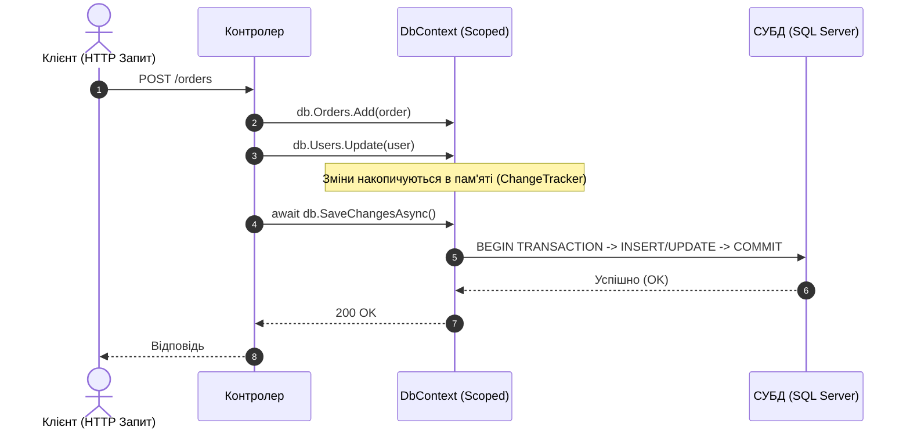

👉 **Пов'язаний код у проєкті:**
- [IntroductionContext.cs](../Chapter01_Introduction/IntroductionContext.cs) 📍 *(дивіться рядки 10–25 — конфігурація контексту)*
- [Program.cs](../Program.cs) 📍 *(дивіться рядки 44–75 — реєстрація Scoped DbContext у DI)*

---
[⬅ Попередній слайд](#slide-2) • [⬆ До змісту](#toc) • [Наступний слайд ➡](#slide-4)

---

<a id="slide-4"></a>
### Слайд 4. Життєвий цикл ChangeTracker: Як EF Core бачить зміни

#### 1. Що це таке простими словами (Життєва аналогія)
**ChangeTracker** — це невидима камера спостереження у кімнаті. Коли ви заносите в кімнату новий предмет (`db.Add`), охорона помічає: *"Цього тут раніше не було"* (`Added`). Коли ви змінюєте колір стіни у відстежуваному об'єкті (`user.Age = 35`), камера фіксує: *"Початковий стан був 34, тепер 35"* (`Modified`). Коли ви кажете прибрати предмет (`db.Remove`), статус стає `Deleted`. Якщо об'єкт просто стоїть і його ніхто не торкався — він `Unchanged`.

#### 2. Яку проблему це вирішує?
Як дізнатися, які саме колонки треба оновити в SQL-запиті `UPDATE`, якщо сутність має 50 властивостей, а користувач змінив лише одне поле `Email`? ChangeTracker пам'ятає `OriginalValue` та `CurrentValue` і формує мінімальний та швидкий SQL `UPDATE Users SET Email = @p0 WHERE Id = @p1`, не перетираючи інші поля.

#### 3. Стани сутності (EntityState)
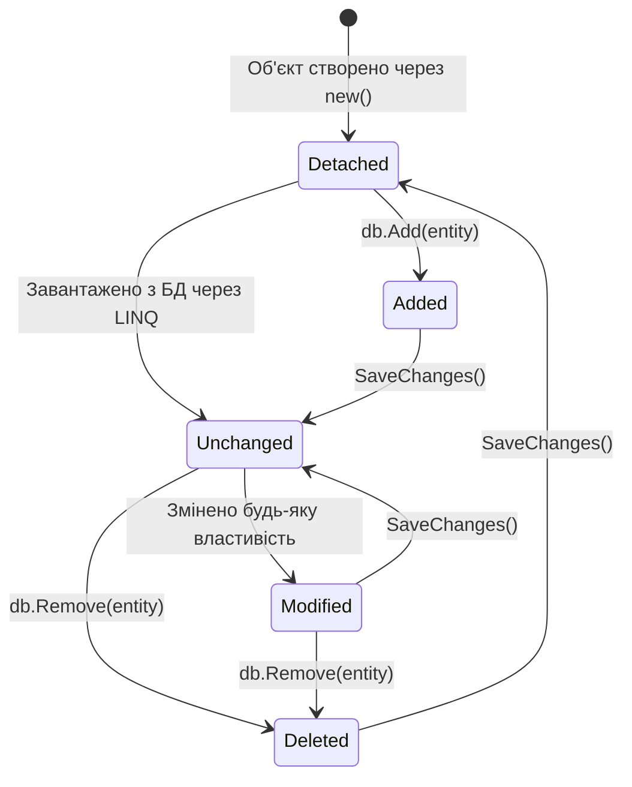

#### 4. Порівняльна таблиця поведінки
| Стан (EntityState) | Що відбулося в C# коді | Що згенерує `SaveChanges()` у SQL |
|---|---|---|
| **Detached** | Об'єкт створено через `new`, контекст про нього не знає | Нічого |
| **Unchanged** | Зчитано з бази, жодне поле не змінювалось | Нічого (запит у БД не надсилається!) |
| **Added** | Викликано `db.Add(entity)` або додано в колекцію | `INSERT INTO ... VALUES (...)` |
| **Modified** | Змінено значення хоча б однієї властивості | `UPDATE ... SET [Col] = @val WHERE Id = ...` |
| **Deleted** | Викликано `db.Remove(entity)` | `DELETE FROM ... WHERE Id = ...` |

👉 **Пов'язаний код у проєкті:**
- [TrackingController.cs](../Chapter06_Queries/Controllers/TrackingController.cs) 📍 *(дивіться рядки 18–48 — інспекція станів ChangeTracker та властивості IsModified)*

---
[⬅ Попередній слайд](#slide-3) • [⬆ До змісту](#toc) • [Наступний слайд ➡](#slide-5)

---

<a id="slide-5"></a>
### Слайд 5. Управління схемою: EnsureCreated проти Migrate (Смертельна пастка)

#### 1. Що це таке простими словами (Життєва аналогія)
- **`EnsureCreated()`** — це одноразовий пластиковий стаканчик. Ви створюєте його на пікніку: якщо стаканчик уже є — користуєтесь; якщо модель змінилась — ви можете лише викинути стаканчик і взяти новий (видалити й перестворити всю базу).
- **`Migrate()`** — це капітальний архітектурний журнал реконструкції будівлі. Якщо ви хочете добудувати другий поверх (додати нову таблицю чи колонку), ви не зносите весь будинок разом із мешканцями (даними), а записуєте нове креслення (міграцію) і безпечно добудовуєте потрібне.

#### 2. Яку конкретну проблему це вирішує?
Початківці часто викликають `Database.EnsureCreated()` у продакшені. Але якщо база вже існує, `EnsureCreated()` **мовчки нічого не робить**. Нові колонки, додані в C# моделі, не створюються в БД, і перший же запит падає з помилкою `Invalid column name`. З іншого боку, `EnsureCreated` ігнорує таблицю `__EFMigrationsHistory`, роблячи подальше використання міграцій неможливим без ручного втручання.

#### 3. Порівняльна таблиця: EnsureCreated vs Migrate
| Критерій | `Database.EnsureCreated()` | `Database.Migrate()` (Міграції) |
|---|---|---|
| **Призначення** | Тести, навчальні пісочниці, локальні прототипи | Справжній Production, CI/CD конвеєри |
| **Збереження даних** | Не підтримує еволюцію схеми (лише повне перестворення) | Дбайливо зберігає всі наявні дані користувачів |
| **Історія змін** | Не відстежується | Фіксується в таблиці `__EFMigrationsHistory` |
| **Генерація SQL-скрипта** | Лише створення всієї схеми з нуля | Покрокові дельта-скрипти `from ... to ...` |

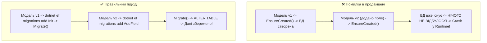

👉 **Пов'язаний код у проєкті:**
- [DatabaseManagementController.cs](../Chapter01_Introduction/Controllers/DatabaseManagementController.cs) 📍 *(дивіться рядки 18–45 — досліди з EnsureCreated/EnsureDeleted)*
- [MigrationsController.cs](../Chapter01_Introduction/Controllers/MigrationsController.cs) 📍 *(дивіться рядки 18–60 — виклик Migrate, відкат та генерація скриптів)*
- [DatabaseBootstrapper.cs](../Infrastructure/DatabaseBootstrapper.cs) 📍 *(дивіться рядки 44–51 — правильне розмежування EnsureCreated та Migrate)*

---
[⬅ Попередній слайд](#slide-4) • [⬆ До змісту](#toc) • [Наступний слайд ➡](#slide-6)

---

<a id="slide-6"></a>
### Слайд 6. Провайдери СУБД: Абстракція ядра від діалектів баз даних

#### 1. Що це таке простими словами (Життєва аналогія)
Ядро EF Core — це операційна система комп'ютера, а провайдер СУБД — це драйвер відеокарти або принтера. Ядро знає, як обробляти команди високого рівня, але як саме фізично замовити сторінку у принтера HP чи Canon (як виконати посторінковий вибір у SQL Server через `OFFSET...FETCH` чи в PostgreSQL через `LIMIT...OFFSET`) — знає лише конкретний драйвер.

#### 2. Яку проблему це вирішує?
Різні СУБД мають абсолютно різний синтаксис, типи даних (наприклад, `JSONB` у Postgres, `rowversion` у SQL Server, відсутність строгих типів у SQLite). Завдяки провайдерам бізнес-код на C# залишається незмінним, змінюється лише реєстрація одного рядка конфігурації у DI.

#### 3. Порівняльна таблиця провайдерів
| Провайдер | NuGet пакет | Специфічні фічі | Приклад підключення |
|---|---|---|---|
| **SQL Server** | `Microsoft.EntityFrameworkCore.SqlServer` | Temporal Tables, HierarchyId, RowVersion, TVF | `options.UseSqlServer(cs)` |
| **PostgreSQL** | `Npgsql.EntityFrameworkCore.PostgreSQL` | JSONB, Arrays, Enums, UUID, Full-Text | `options.UseNpgsql(cs)` |
| **MySQL** | `Pomelo.EntityFrameworkCore.MySql` | ServerVersion auto-detection, MariaDB | `options.UseMySql(cs, version)` |
| **SQLite** | `Microsoft.EntityFrameworkCore.Sqlite` | Локальні файли, ідеальний для десктопу/мобільних | `options.UseSqlite(cs)` |

👉 **Пов'язаний код у проєкті:**
- [ProvidersController.cs](../Chapter02_Providers/Controllers/ProvidersController.cs) 📍 *(дивіться рядки 24–65 — динамічна інспекція провайдера та каталог можливостей)*

---
[⬅ Попередній слайд](#slide-5) • [⬆ До змісту](#toc) • [Наступний слайд ➡](#slide-7)

---

<a id="slide-7"></a>
### Слайд 7. Стійкість підключень: Connection Resiliency & Retry Strategies

#### 1. Що це таке простими словами (Життєва аналогія)
Уявіть телефонну розмову в тунелі метро. Зв'язок періодично зникає на 1–2 секунди. Поганий співрозмовник одразу кине слухавку і заявить, що діалог зірвано. Розумний співрозмовник почекає мить і скаже: *"Алло, я тут, повтори останнє слово"*. **Connection Resiliency в EF Core** — це механізм автоматичних розумних повторів (retry) при короткочасних мережевих розривах у хмарі (Transient Faults).

#### 2. Яку проблему це вирішує?
У хмарних середовищах (Azure SQL, AWS RDS, Kubernetes) перепідключення вузлів або мікроперезавантаження бази трапляються постійно. Без стратегії повторів застосунок бомбардуватиме користувачів помилками 500 Internal Server Error.

#### 3. Порівняння: Звичайне підключення vs Connection Resiliency
```csharp
// ❌ Наївно: будь-яке секундне мережеве коливання кине SqlException
options.UseSqlServer(connectionString);

// ✅ Надійно: автоматичний повтор до 5 разів з експоненційною затримкою
options.UseSqlServer(connectionString, sqlOptions =>
{
    sqlOptions.EnableRetryOnFailure(
        maxRetryCount: 5,
        maxRetryDelay: TimeSpan.FromSeconds(10),
        errorNumbersToAdd: null);
});
```

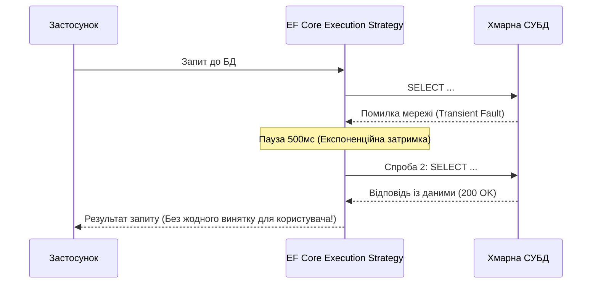

👉 **Пов'язаний код у проєкті:**
- [ProvidersController.cs](../Chapter02_Providers/Controllers/ProvidersController.cs) 📍 *(дивіться рядки 85–125 — розбір параметрів EnableRetryOnFailure та транзакційних блоків)*

---
[⬅ Попередній слайд](#slide-6) • [⬆ До змісту](#toc) • [Наступний слайд ➡](#slide-8)

---

<a id="slide-8"></a>
### Слайд 8. Моделювання даних: Data Annotations проти Fluent API

#### 1. Що це таке простими словами (Життєва аналогія)
- **Data Annotations (Атрибути над властивостями)** — це стікери-нагадування, наклеєні прямо на лоб людині. Зручно бачити, але людина (доменна сутність) виглядає забрудненою і прив'язаною до інфраструктурних правил.
- **Fluent API** — це окремий детальний паспортний стіл (`IEntityTypeConfiguration<T>`). Сама людина залишається чистою та охайною (Plain Old C# Object, POCO), а всі правила збереження її даних описані в окремому реєстрі.

#### 2. Яку проблему це вирішує?
Принципи Clean Architecture вимагають, щоб доменні сутності не залежали від сторонніх бібліотек чи деталей БД. Ба більше, половину складних налаштувань (складені ключі, фільтровані індекси, власні типи, альтернативні ключі) через атрибути фізично **неможливо** налаштувати — вони доступні лише у Fluent API.

#### 3. Порівняльна таблиця підходів
| Можливість | Data Annotations (`[Required]`, `[MaxLength]`) | Fluent API (`builder.Property(...)`) |
|---|---|---|
| **Чистота доменної моделі** | Порушується (засмічує класи атрибутами) | 100% чистий POCO без залежностей від EF |
| **Гнучкість конфігурації** | Обмежена базовими перевірками | Максимальна (доступні всі можливості СУБД) |
| **Складені ключі / індекси** | Не підтримується (або обмежено) | Повна підтримка `.HasKey(x => new { x.A, x.B })` |
| **Масштабованість проєкту** | Важко підтримувати при 100+ полях | Ідеально розбивається на окремі класи конфігурацій |

👉 **Пов'язаний код у проєкті:**
- [Product.cs](../Chapter03_Models/Models/Product.cs) 📍 *(дивіться рядки 8–28 — Data Annotations на сутності)*
- [CategoryConfiguration.cs](../Chapter03_Models/Configurations/CategoryConfiguration.cs) 📍 *(дивіться рядки 9–25 — чиста конфігурація через IEntityTypeConfiguration)*
- [ModelsContext.cs](../Chapter03_Models/ModelsContext.cs) 📍 *(дивіться рядки 25–46 — Fluent API в OnModelCreating)*

---
[⬅ Попередній слайд](#slide-7) • [⬆ До змісту](#toc) • [Наступний слайд ➡](#slide-9)

---

<a id="slide-9"></a>
### Слайд 9. Ключі, індекси та обмеження цілісності (Alternate Keys & Filtered Indexes)

#### 1. Що це таке простими словами (Життєва аналогія)
- **Primary Key (PK)** — це номер паспорта громадянина.
- **Alternate Key (AK)** — це номер індивідуального податкового номера (ІПН) або електронна пошта: вони теж строго унікальні, ніколи не повторюються і можуть використовуватись як ціль для зовнішнього ключа.
- **Filtered Index (Фільтрований індекс)** — це покажчик у телефонній книзі тільки для тих людей, які мають номер мобільного (ігноруючи мільйони порожніх записів з `NULL`).

#### 2. Яку проблему це вирішує?
1. Якщо зробити звичайний унікальний індекс по стовпцю `Phone`, який дозволяє `NULL`, то в стандартному SQL Server ви зможете вставити лише **один** запис із `NULL`! Решта впадуть з помилкою дублікату. **Фільтрований індекс** дозволяє нескінченну кількість `NULL`, але вимагає унікальності від заповнених значень.
2. `HasCheckConstraint` захищає базу від некоректних даних (наприклад, від'ємна ціна `[Price] >= 0`), навіть якщо помилка виникне в обхід бекенду через прямий скрипт адміністратора.

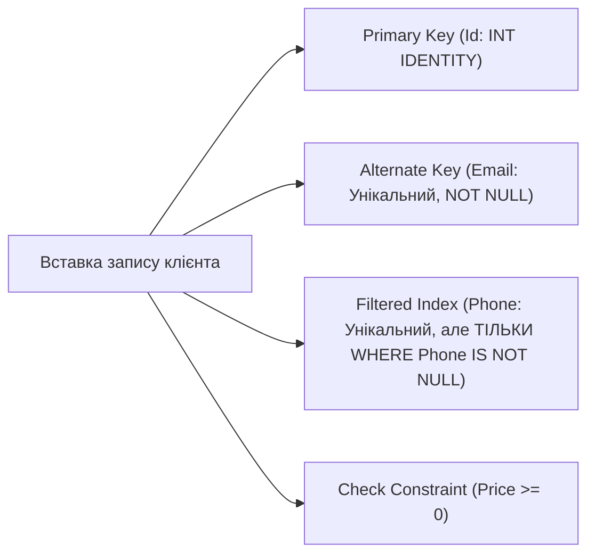

👉 **Пов'язаний код у проєкті:**
- [Customer.cs](../Chapter03_Models/Models/Customer.cs) 📍 *(дивіться рядки 8–24 — модель з альтернативним ключем)*
- [KeysAndIndexesController.cs](../Chapter03_Models/Controllers/KeysAndIndexesController.cs) 📍 *(дивіться рядки 18–50 — ендпоінти інспекції ключів та індексів)*
- [ModelsContext.cs](../Chapter03_Models/ModelsContext.cs) 📍 *(дивіться рядки 47–64 — налаштування HasAlternateKey та HasFilter)*

---
[⬅ Попередній слайд](#slide-8) • [⬆ До змісту](#toc) • [Наступний слайд ➡](#slide-10)

---

<a id="slide-10"></a>
### Слайд 10. Генерація значень та інкапсуляція: Computed Columns & Backing Fields

#### 1. Що це таке простими словами (Життєва аналогія)
- **Computed Column (Обчислюваний стовпець)** — це автоматичний калькулятор прямо всередині таблиці. Ви вводите ціну товару, а СУБД сама рахує `Ціна з ПДВ = Ціна * 1.20`.
- **Backing Field (Приховане поле)** — це одометр у машині. Пасажир може бачити кілометраж через скло (властивість тільки для читання `public int ViewCount => _viewCount;`), але не може підкрутити його пальцем. Змінити його можна лише через спеціальну педаль (метод `IncrementViews()`).

#### 2. Яку проблему це вирішує?
1. Обчислювані стовпці усувають розсинхронізацію: більше немає потреби в C# рахувати ПДВ і сподіватися, що ніхто не оновить одне поле без іншого.
2. Backing fields дозволяють створювати справжній Rich Domain Model: приватні поля стану, доступні на зміну лише через методи валідації бізнес-правил, які EF Core вміє завантажувати й зберігати напряму.

#### 3. Порівняння: Анемічна модель vs Rich Model з Backing Fields
```csharp
// ❌ Анемічна модель: будь-хто може написати article.ViewCount = -999;
public class Article { public int ViewCount { get; set; } }

// ✅ Інкапсульована Rich Model: EF Core пише напряму в _viewCount через HasField()
public class Article 
{
    private int _viewCount;
    public int ViewCount => _viewCount;
    public void IncrementViews() => _viewCount++;
}
```

👉 **Пов'язаний код у проєкті:**
- [Article.cs](../Chapter03_Models/Models/Article.cs) 📍 *(дивіться рядки 7–29 — клас із backing field та конструктором)*
- [ValueGenerationController.cs](../Chapter03_Models/Controllers/ValueGenerationController.cs) 📍 *(дивіться рядки 20–55 — перевірка обчислених полів та обмежень)*

---
[⬅ Попередній слайд](#slide-9) • [⬆ До змісту](#toc) • [Наступний слайд ➡](#slide-11)

---

<a id="slide-11"></a>
### Слайд 11. Зв'язки між сутностями: One-to-Many та One-to-One

#### 1. Що це таке простими словами (Життєва аналогія)
- **Один-до-багатьох (1:N)** — це автор і його книги або блог і його пости (`Blog` $\rightarrow$ `List<Post>`). В одній книзі може бути лише один автор, але автор може написати безліч книг.
- **Один-до-одного (1:1)** — це громадянин і його біометричний паспорт (`User` $\rightarrow$ `UserProfile`). Паспорт не може існувати без громадянина, а громадянин має лише один активний паспорт.

#### 2. Яку проблему це вирішує?
Неправильно налаштовані зовнішні ключі (Foreign Keys) призводять до "сутностей-сиріт" (пости, у яких видалили блог, зависають у базі назавжди) або до дублювання записів у таблицях 1:1 через відсутність унікального індексу на FK.

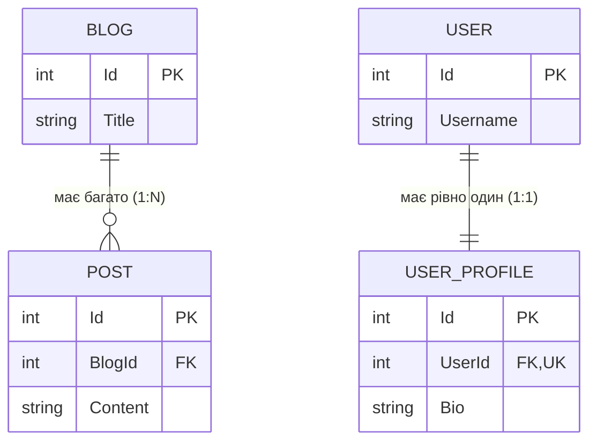

#### 3. Налаштування у Fluent API
```csharp
// 1:N — Блог та Пости
modelBuilder.Entity<Blog>()
    .HasMany(b => b.Posts)
    .WithOne(p => p.Blog)
    .HasForeignKey(p => p.BlogId);

// 1:1 — Користувач і Профіль (UserId у профілі є УНІКАЛЬНИМ)
modelBuilder.Entity<User>()
    .HasOne(u => u.Profile)
    .WithOne(p => p.User)
    .HasForeignKey<UserProfile>(p => p.UserId);
```

👉 **Пов'язаний код у проєкті:**
- [OneToManyController.cs](../Chapter04_Relationships/Controllers/OneToManyController.cs) 📍 *(дивіться рядки 18–45 — зв'язок 1:N)*
- [OneToOneController.cs](../Chapter04_Relationships/Controllers/OneToOneController.cs) 📍 *(дивіться рядки 18–40 — зв'язок 1:1)*

---
[⬅ Попередній слайд](#slide-10) • [⬆ До змісту](#toc) • [Наступний слайд ➡](#slide-12)

---

<a id="slide-12"></a>
### Слайд 12. Many-to-Many та ієрархічні структури (Self-Referencing)

#### 1. Що це таке простими словами (Життєва аналогія)
- **Багато-до-багатьох (M:N)** — студенти та навчальні курси (`Student` $\leftrightarrow$ `Course`). Студент відвідує 5 курсів, а на кожному курсі навчаються сотні студентів.
- **Ієрархічні структури (Self-Referencing)** — дерево підпорядкування у компанії (`Employee` $\rightarrow$ `Manager`). Генеральний директор є співробітником, і менеджер проекту — теж співробітник. Зовнішній ключ посилається на ту саму таблицю!

#### 2. Яку проблему це вирішує?
1. В EF Core 7+ зв'язок M:N можна створювати неявно (просто `List<Course>` у студента), але якщо на стику потрібні дані (дата запису на курс, оцінка, номер договору), потрібна **явна проміжна сутність** (`Enrollment`).
2. Self-referencing моделює нескінченні рівні дерев (категорії товарів, коментарі з відповідями, організаційні структури) в межах однієї таблиці.

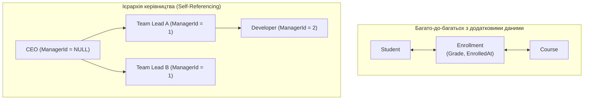

👉 **Пов'язаний код у проєкті:**
- [ManyToManyController.cs](../Chapter04_Relationships/Controllers/ManyToManyController.cs) 📍 *(дивіться рядки 18–50 — сутність зв'язку Enrollment)*
- [HierarchicalDataController.cs](../Chapter04_Relationships/Controllers/HierarchicalDataController.cs) 📍 *(дивіться рядки 18–60 — рекурсивна побудова дерева керівників)*

---
[⬅ Попередній слайд](#slide-11) • [⬆ До змісту](#toc) • [Наступний слайд ➡](#slide-13)

---

<a id="slide-13"></a>
### Слайд 13. Value Objects у реляційній БД: Owned Types проти Complex Types

#### 1. Що це таке простими словами (Життєва аналогія)
Уявіть поштову адресу: місто, вулиця, індекс. Чи має адреса власний паспорт (Id)? Ні. Якщо дві людини живуть за однією адресою, це не означає, що адреса — це жива сутність. Це **Value Object (Об'єкт-значення)** — група полів, яка має сенс лише разом.

#### 2. Різниця між Owned Types та Complex Types (EF Core 8+)
- **Owned Entity Types (`OwnsOne`)**: Були єдиним способом до EF Core 8. Технічно вони вважалися прихованими сутностями і створювали накладні витрати на ChangeTracker.
- **Complex Types (`ComplexProperty`)**: Додані в EF Core 8. Це справжні незмінні Value Objects на рівні фреймворку: вони **не мають Id**, ніколи не є окремими сутностями і зберігаються в тій самій таблиці, що й батьківська сутність.

#### 3. Порівняльна таблиця
| Характеристика | Власні типи (Owned Types) | Комплексні типи (Complex Types) |
|---|---|---|
| **Версія EF Core** | EF Core 2.0+ | EF Core 8.0+ |
| **Природа в системі** | Прихована сутність (Entity) зі штучним ключем | Справжній Value Object (не сутність) |
| **Стовпці в базі** | За замовчуванням у тій самій таблиці (або `OwnsMany` в окремій) | Завжди спільна таблиця батька |
| **Підтримка `null`** | Дозволяє null-об'єкти | Дозволяє null (в EF Core 9/10) |
| **Рекомендація** | Для сутностей без явного ключа | **Для чистих DDD Value Objects (Address, Money)** |

👉 **Пов'язаний код у проєкті:**
- [OwnedTypesController.cs](../Chapter04_Relationships/Controllers/OwnedTypesController.cs) 📍 *(дивіться рядки 18–45 — робота з OwnsOne / OwnsMany)*
- [ComplexTypesController.cs](../Chapter04_Relationships/Controllers/ComplexTypesController.cs) 📍 *(дивіться рядки 18–50 — новітні ComplexProperty)*

---
[⬅ Попередній слайд](#slide-12) • [⬆ До змісту](#toc) • [Наступний слайд ➡](#slide-14)

---

<a id="slide-14"></a>
### Слайд 14. Каскадні операції: Cascade, SetNull, Restrict (Безпека видалення)

#### 1. Що це таке простими словами (Життєва аналогія)
Що відбувається з меблями в орендованій квартирі, якщо будинок зносять?
- **Cascade (Каскад)**: Меблі зникають разом із будинком. (Видалили автора — автоматично видалилися всі його 100 статей).
- **SetNull (Обнулення)**: Меблі виносять на вулицю без прив'язки до квартири. (Компанію ліквідували — працівники залишились, але їхній `CompanyId` став `NULL`).
- **Restrict / NoAction (Заборона)**: Будинок заборонено зносити, поки всередині є хоч один стілець! База видає жорстку помилку.

#### 2. Яку проблему це вирішує?
Неконтрольований `DeleteBehavior.Cascade` — найчастіша причина випадкового знищення критичних даних (коли один джуніор видалив категорію, а база знесла всі товари й історію замовлень магазину за 5 років).

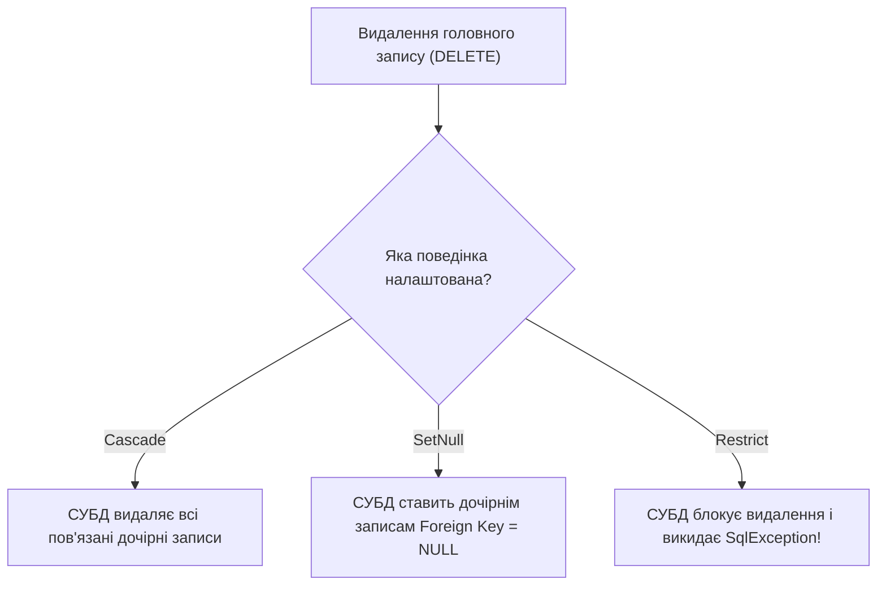

👉 **Пов'язаний код у проєкті:**
- [CascadeDeleteController.cs](../Chapter04_Relationships/Controllers/CascadeDeleteController.cs) 📍 *(дивіться рядки 18–70 — наочна поведінка кожного з трьох режимів видалення)*

---
[⬅ Попередній слайд](#slide-13) • [⬆ До змісту](#toc) • [Наступний слайд ➡](#slide-15)

---

<a id="slide-15"></a>
### Слайд 15. Стратегії завантаження: Eager, Explicit, Lazy Loading та проблема N+1

#### 1. Що це таке простими словами (Життєва аналогія)
- **Eager Loading (`Include`)** — оптова доставка вантажівкою. Ви замовили піцу, соус і напій, і кур'єр привіз усе в одному пакеті за одну поїздку.
- **Explicit Loading (`Load`)** — ви з'їли піцу, зрозуміли, що хочете соус, і окремо відправили кур'єра за соусом.
- **Lazy Loading (Ліниве завантаження через проксі)** — катастрофа ресторану (проблема N+1). Ви берете шматочок піци — кур'єр біжить за серветкою; берете другий шматочок — кур'єр знову біжить за другою серветкою. Замість 1 поїздки ви створили 101 рейс!

#### 2. Порівняння запитів у базі даних
```csharp
// ❌ Смертельна пастка Lazy Loading (Проблема N+1):
var teams = db.Teams.ToList(); // 1 запит на команди
foreach (var team in teams)
    Console.WriteLine(team.Players.Count); // + N ОКРЕМИХ ЗАПИТІВ У БАЗУ ДЛЯ КОЖНОЇ КОМАНДИ!

// ✅ Eager Loading: рівно 1 запит із JOIN
var teams = db.Teams.Include(t => t.Players).ToList();
```

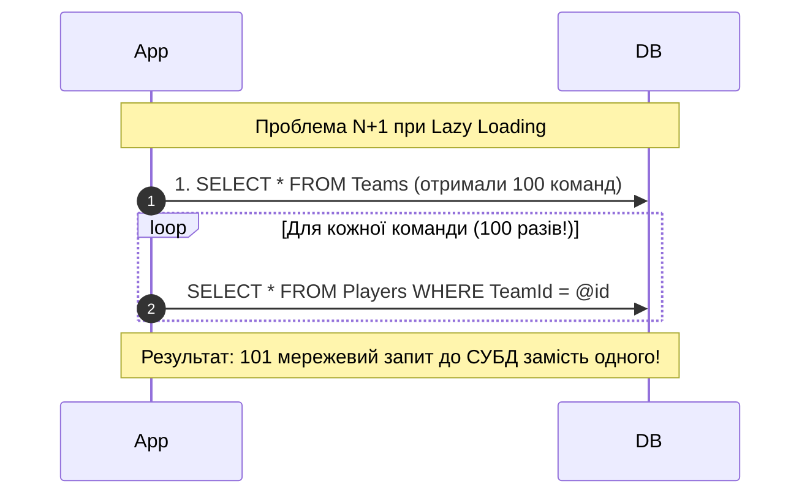

👉 **Пов'язаний код у проєкті:**
- [LoadingRelatedDataController.cs](../Chapter04_Relationships/Controllers/LoadingRelatedDataController.cs) 📍 *(дивіться рядки 18–60 — Include, ThenInclude, Filtered Include, Explicit)*
- [LazyLoadingController.cs](../Chapter04_Relationships/Controllers/LazyLoadingController.cs) 📍 *(дивіться рядки 18–45 — живе порівняння SQL при Lazy проти Eager Loading)*

---
[⬅ Попередній слайд](#slide-14) • [⬆ До змісту](#toc) • [Наступний слайд ➡](#slide-16)

---

<a id="slide-16"></a>
### Слайд 16. Успадкування в реляційній СУБД: Стратегія TPH (Table Per Hierarchy)

#### 1. Що це таке простими словами (Життєва аналогія)
У реляційних базах немає ключового слова `class Manager : Employee`. База знає лише таблиці. **TPH (Table Per Hierarchy)** — це спільний готельний номер для всієї родини. Батько (User), син (Employee) і дідусь (Manager) живуть в одній великій кімнаті. На дверях висить табличка-дискримінатор: хто саме зараз спить на ліжку.

#### 2. Як це влаштовано
- **Одна фізична таблиця `Users_TPH`** на всі класи ієрархії.
- Обов'язковий стовпець `UserType` (Discriminator).
- Якщо запис є звичайним користувачем, його колонки `Company`, `Salary`, `Department` заповнені `NULL`.

#### 3. Переваги та компроміси TPH
- ➕ **Блискавична швидкість вибірки**: Жодних `JOIN` або `UNION` — читається лише одна таблиця.
- ➖ **Денормалізація**: Стовпці похідних класів повинні допускати `NULL`, навіть якщо для працівника зарплата логічно обов'язкова!

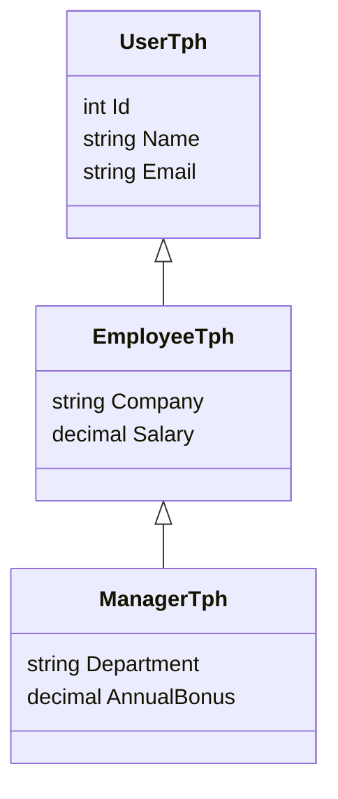

👉 **Пов'язаний код у проєкті:**
- [TphModels.cs](../Chapter05_Inheritance/Models/TphModels.cs) 📍 *(дивіться рядки 7–32 — ієрархія класів)*
- [TphController.cs](../Chapter05_Inheritance/Controllers/TphController.cs) 📍 *(дивіться рядки 20–55 — поліморфні запити та OfType)*

---
[⬅ Попередній слайд](#slide-15) • [⬆ До змісту](#toc) • [Наступний слайд ➡](#slide-17)

---

<a id="slide-17"></a>
### Слайд 17. Успадкування: Стратегії TPT (Table Per Type) та TPC (Table Per Class)

#### 1. Порівняння концепцій
- **TPT (Table Per Type)** — окрема квартира для кожного члена родини. Базова таблиця містить спільні поля, а кожна таблиця-нащадок має PK, який одночасно є FK на базову таблицю.
- **TPC (Table Per Class, EF Core 7+)** — кожен живе у своєму окремому будинку на іншому кінці міста. Для базового класу **взагалі немає таблиці в БД**! Кожна конкретна таблиця містить повний набір стовпців.

#### 2. Зведена матриця вибору стратегії
| Характеристика | TPH (За замовчуванням) | TPT (Нормалізований) | TPC (EF Core 7+) |
|---|---|---|---|
| **Кількість таблиць** | 1 таблиця | 1 базова + N для нащадків | N таблиць (для кожного класу) |
| **Стовпець-дискримінатор** | Обов'язковий (`Discriminator`) | Не потрібен | Не потрібен |
| **SQL поліморфного запиту** | `SELECT ... FROM Table` | `LEFT JOIN` для кожної таблиці | `UNION ALL` по всіх таблицях |
| **Запит конкретного нащадка** | `WHERE Discriminator = 'X'` | `INNER JOIN` з базовою | `SELECT ... FROM TableX` (без JOIN!) |
| **Підтримка NOT NULL** | Ні (для полів нащадків) | Так (повна нормалізація) | Так |

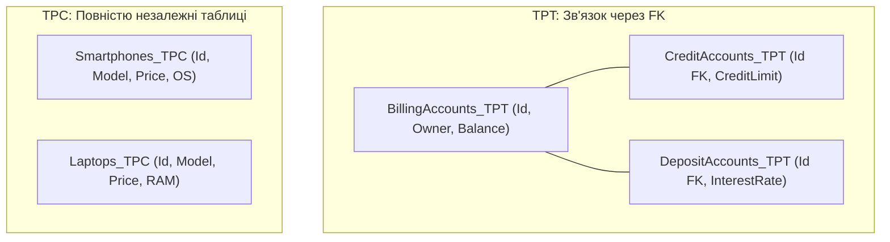

👉 **Пов'язаний код у проєкті:**
- [TptController.cs](../Chapter05_Inheritance/Controllers/TptController.cs) 📍 *(дивіться рядки 20–55 — TPT запити з JOIN)*
- [TpcController.cs](../Chapter05_Inheritance/Controllers/TpcController.cs) 📍 *(дивіться рядки 20–55 — TPC запити з UNION ALL)*
- [InheritanceComparisonController.cs](../Chapter05_Inheritance/Controllers/InheritanceComparisonController.cs) 📍 *(дивіться рядки 22–70 — порівняльний DDL-скрипт)*

---
[⬅ Попередній слайд](#slide-16) • [⬆ До змісту](#toc) • [Наступний слайд ➡](#slide-18)

---

<a id="slide-18"></a>
### Слайд 18. Анатомія LINQ: IEnumerable проти IQueryable (Межа "БД vs Пам'ять")

#### 1. Що це таке простими словами (Життєва аналогія)
- **`IQueryable`** — це замовлення шеф-кухарю ресторану. Ви передаєте меню з поміткою *"Приготувати суп без цибулі"*. Кухар готує суп уже без цибулі на кухні (СУБД фільтрує дані у SQL `WHERE`).
- **`IEnumerable`** — це коли ви попросили принести 100 літрів супу з усіма інгредієнтами до вашого столу, вилили це все в каструлю і сидите виделкою виловлюєте шматочки цибулі в оперативній пам'яті клієнта.

#### 2. Катастрофа переходу в IEnumerable
Якщо ви випадково викличете `.AsEnumerable()` або `.ToList()` до виклику `.Where()`, EF Core викачає **всю таблицю з мільйонами рядків** по мережі у ваш додаток і фільтруватиме її процесором бекенду!

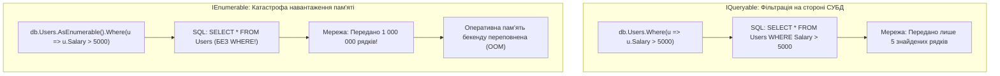

👉 **Пов'язаний код у проєкті:**
- [QueryExecutionController.cs](../Chapter06_Queries/Controllers/QueryExecutionController.cs) 📍 *(дивіться рядки 45–70 — живе порівняння IQueryable проти IEnumerable)*

---
[⬅ Попередній слайд](#slide-17) • [⬆ До змісту](#toc) • [Наступний слайд ➡](#slide-19)

---

<a id="slide-19"></a>
### Слайд 19. Оптимізація читання: AsNoTracking та Identity Resolution

#### 1. Що це таке простими словами (Життєва аналогія)
Коли ви берете книгу в бібліотеці почитати в читальному залі без наміру щось у ній виправляти, бібліотекар не заводить на вас картку обліку ревізій. **`AsNoTracking()`** каже EF Core: *"Я просто читаю дані для показу на екрані (GET-запит). Не фотографуй ці об'єкти для ChangeTracker і не витрачай ресурси"*.

#### 2. Чому це дає приріст до 2-3 разів
- Об'єкти не додаються до словників `ChangeTracker`.
- Не створюються копії початкових значень (`Snapshot`).
- Зменшується тиск на Garbage Collector (GC).

#### 3. Identity Resolution (Вирішення ідентичності)
За замовчуванням `AsNoTracking()` при створенні об'єктів створює дублікати екземплярів, якщо вони повторюються у вибірці. Якщо вам потрібні унікальні посилання на спільні екземпляри без трекінгу змін — використовуйте `AsNoTrackingWithIdentityResolution()`.

👉 **Пов'язаний код у проєкті:**
- [TrackingController.cs](../Chapter06_Queries/Controllers/TrackingController.cs) 📍 *(дивіться рядки 18–60 — порівняння Tracking, NoTracking та IdentityResolution)*

---
[⬅ Попередній слайд](#slide-18) • [⬆ До змісту](#toc) • [Наступний слайд ➡](#slide-20)

---

<a id="slide-20"></a>
### Слайд 20. Глобальні фільтри запитів: Soft Delete та Multi-Tenancy

#### 1. Що це таке простими словами (Життєва аналогія)
Уявіть сонцезахисні окуляри з поляризаційним фільтром. Ви дивитесь на світ, і відблиски автоматично зникають із вашого поля зору. **`HasQueryFilter`** — це постійний фільтр на рівні моделі, який автоматично дописує умову (наприклад, `WHERE IsDeleted = 0` або `WHERE TenantId = @currentTenant`) до **кожного** вашого запиту в усій системі.

#### 2. Яку проблему це вирішує?
При м'якому видаленні (Soft Delete) розробники постійно забувають дописати `&& !x.IsDeleted` у кожному `Where()`. У результаті "видалені" користувачі або замовлення з'являються у фінансових звітах. Глобальний фільтр усуває цей ризик назавжди.

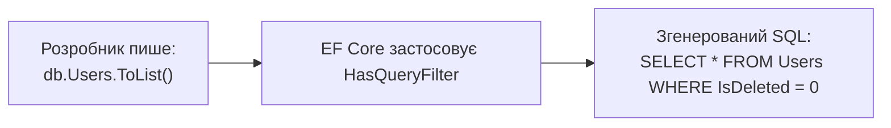

```csharp
// Налаштування у DbContext
modelBuilder.Entity<User>().HasQueryFilter(u => !u.IsDeleted);

// Якщо адміністратору потрібно побачити все, включно з видаленими:
var allUsers = db.Users.IgnoreQueryFilters().ToList();
```

👉 **Пов'язаний код у проєкті:**
- [QueryFiltersController.cs](../Chapter06_Queries/Controllers/QueryFiltersController.cs) 📍 *(дивіться рядки 18–45 — HasQueryFilter та метод IgnoreQueryFilters)*

---
[⬅ Попередній слайд](#slide-19) • [⬆ До змісту](#toc) • [Наступний слайд ➡](#slide-21)

---

<a id="slide-21"></a>
### Слайд 21. Масові операції: ExecuteUpdate та ExecuteDelete

#### 1. Що це таке простими словами (Життєва аналогія)
Вам потрібно змінити тариф для 100 000 клієнтів.
- **Старий класичний підхід**: Завантажити 100 000 клієнтів в оперативну пам'ять сервера, створити 100 000 C# об'єктів у ChangeTracker, у циклі змінити поле `TariffId`, викликати `SaveChanges()` і надіслати 100 000 окремих `UPDATE` або гігантські пачки SQL. (Сервер зависає, пам'ять вичерпано).
- **Сучасний `ExecuteUpdate` (EF Core 7+)**: Ви відправляєте одну пряму команду в СУБД: *"Онови тариф усім клієнтам, де статус активний"*. СУБД миттєво змінює дані на диску за 10 мілісекунд, не завантажуючи жодного байта в C#!

#### 2. Порівняльна таблиця
| Критерій | Класичний `SaveChanges()` | `ExecuteUpdate` / `ExecuteDelete` |
|---|---|---|
| **Завантаження в пам'ять** | Вимагає повного читання всіх сутностей | **0 байтів пам'яті** (виконується на сервері БД) |
| **Участь ChangeTracker** | Кожна сутність відстежується | ChangeTracker повністю ігнорується |
| **Швидкість на 100K рядків** | Хвилини (або OutOfMemoryException) | **Мілісекунди** |
| **Згенерований SQL** | Масові окремі оператори | Один прямий `UPDATE ... WHERE ...` |

👉 **Пов'язаний код у проєкті:**
- [BulkOperationsController.cs](../Chapter06_Queries/Controllers/BulkOperationsController.cs) 📍 *(дивіться рядки 20–55 — прямий підйом зарплати та масове видалення)*

---
[⬅ Попередній слайд](#slide-20) • [⬆ До змісту](#toc) • [Наступний слайд ➡](#slide-22)

---

<a id="slide-22"></a>
### Слайд 22. Гібридний підхід: FromSql, збережені функції (UDF) та процедури

#### 1. Що це таке простими словами (Життєва аналогія)
EF Core — це не тюрма. Якщо у вас є суперскладний аналітичний SQL-запит на 5 сторінок з віконними функціями `ROW_NUMBER() OVER (...)`, який неможливо або неефективно виразити через LINQ — ви можете виконати чистий SQL, отримати його результат у сутності C# та безпечно продовжити роботу з LINQ!

#### 2. Можливості інтеграції із СУБД
1. **`FromSql($"SELECT ... WHERE Price > {minPrice}")`**: Параметризований, 100% захищений від SQL-ін'єкцій.
2. **Компонування LINQ**: Можна написати `db.Products.FromSql(...).Where(...).OrderBy(...)` — EF Core запакує сирий SQL у підзапит!
3. **Скалярні функції (`HasDbFunction`)**: Виклик функції СУБД прямо всередині LINQ `Select` чи `Where`.
4. **Збережені процедури (Stored Procedures)**: Виклик процедур із вихідними параметрами `OUTPUT`.

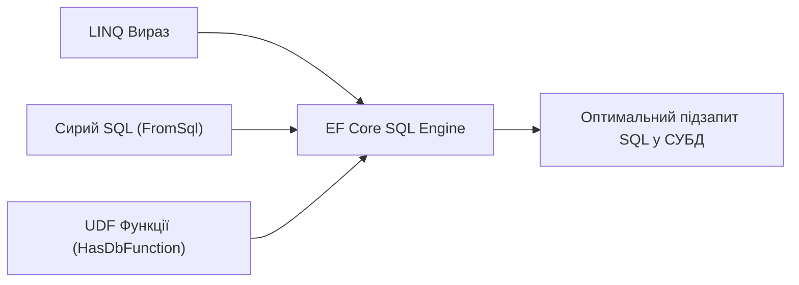

👉 **Пов'язаний код у проєкті:**
- [RawSqlController.cs](../Chapter07_Sql/Controllers/RawSqlController.cs) 📍 *(дивіться рядки 20–60 — FromSql, SqlQuery, ExecuteSql)*
- [StoredFunctionsController.cs](../Chapter07_Sql/Controllers/StoredFunctionsController.cs) 📍 *(дивіться рядки 20–50 — скалярні та табличні функції)*
- [StoredProceduresController.cs](../Chapter07_Sql/Controllers/StoredProceduresController.cs) 📍 *(дивіться рядки 20–75 — виклик процедур із вихідними параметрами)*

---
[⬅ Попередній слайд](#slide-21) • [⬆ До змісту](#toc) • [Наступний слайд ➡](#slide-23)

---

<a id="slide-23"></a>
### Слайд 23. Оптимістичний паралелізм: Токени RowVersion та гонки даних

#### 1. Що це таке простими словами (Життєва аналогія)
Два редактори одночасно відкрили статтю з текстом "Версія 1".
- Перший редактор змінив слово і натиснув "Зберегти". Стаття стала "Версією 2".
- Другий редактор, який дивився на "Версію 1", теж тисне "Зберегти". Якщо немає контролю паралелізму — він непомітно перетре всі зміни першого автора!
- **Токен паралелізму (`RowVersion`)** — це версійна печатка на документі. При спробі збереження СУБД перевіряє: *"Ти редагував версію 1, а в базі вже версія 2! Збереження заборонено!"* і викидає `DbUpdateConcurrencyException`.

#### 2. Як це працює під капотом
```csharp
// У SQL Server стовпець byte[] RowVersion отримує тип даних rowversion
modelBuilder.Entity<BankAccount>().Property(b => b.RowVersion).IsRowVersion();

// При генерації UPDATE EF Core автоматично додає стару мітку версії у WHERE:
// UPDATE BankAccounts SET Balance = 1500 WHERE Id = 1 AND RowVersion = 0x0000001;
// Якщо інший потік оновив рядок першим, версія вже змінилася -> 0 рядків оновлено -> EXCEPTION!
```

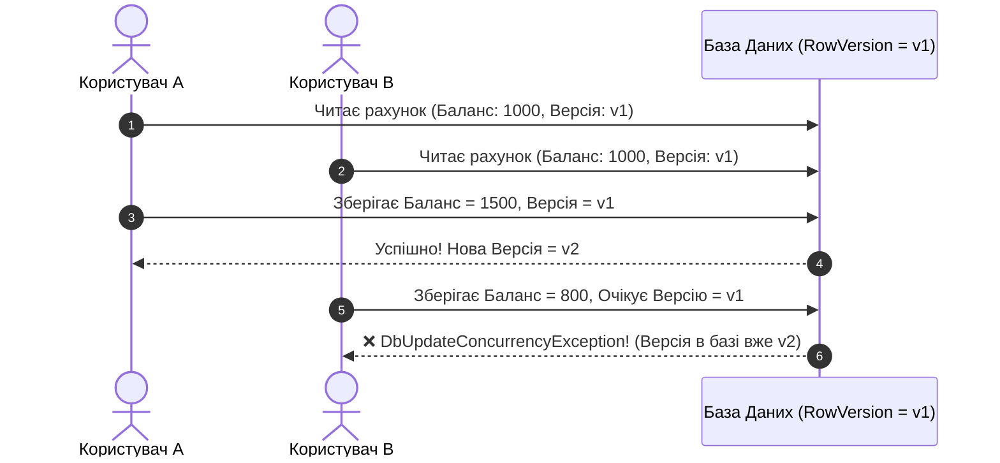

👉 **Пов'язаний код у проєкті:**
- [ConcurrencyController.cs](../Chapter08_Advanced/Controllers/ConcurrencyController.cs) 📍 *(дивіться рядки 45–125 — симуляція конфлікту та стратегії вирішення DatabaseWins / ClientWins)*

---
[⬅ Попередній слайд](#slide-22) • [⬆ До змісту](#toc) • [Наступний слайд ➡](#slide-24)

---

<a id="slide-24"></a>
### Слайд 24. Машина часу: Темпоральні таблиці SQL Server та Скомпільовані запити

#### 1. Що це таке простими словами (Життєва аналогія)
- **Темпоральні таблиці (`IsTemporal`)** — це вбудована машина часу для ваших даних. Якщо бухгалтер запитує: *"Яким був баланс компанії рівно 15 травня 2025 року о 14:32:00?"*, вам більше не потрібно вручну копатися в аудит-логах. Ви пишете `db.Documents.TemporalAsOf(dateTime)` і читаєте стан системи на ту секунду.
- **Скомпільовані запити (`EF.CompileQuery`)** — це заздалегідь розігрітий двигун спорткара. Звичайний LINQ витрачає 20–30% часу на парсинг дерева виразів C# перед кожним викликом. Скомпільований запит робить це один раз і зберігає готовий делегат.

#### 2. Запити до темпоральних таблиць
```csharp
// 1. Повернутися назад у часі на конкретну дату
var pastDocument = await db.Documents
    .TemporalAsOf(targetUtcDate)
    .FirstOrDefaultAsync(d => d.Id == id);

// 2. Отримати всю історію всіх ревізій документа
var history = await db.Documents
    .TemporalAll()
    .Where(d => d.Id == id)
    .Select(d => new { d.Title, Start = EF.Property<DateTime>(d, "PeriodStart") })
    .ToListAsync();
```

👉 **Пов'язаний код у проєкті:**
- [TemporalTablesController.cs](../Chapter08_Advanced/Controllers/TemporalTablesController.cs) 📍 *(дивіться рядки 20–80 — версіонування документів)*
- [CompiledQueriesController.cs](../Chapter08_Advanced/Controllers/CompiledQueriesController.cs) 📍 *(дивіться рядки 20–65 — EF.CompileQuery та заміри швидкодії)*

---
[⬅ Попередній слайд](#slide-23) • [⬆ До змісту](#toc) • [Наступний слайд ➡](#slide-25)

---

<a id="slide-25"></a>
### Слайд 25. Зведена шпаргалка архітектора: Чекліст підготовки до Production

#### 1. Десять золотих правил роботи з EF Core 10
1. **Завжди використовуйте `AsNoTracking()` для операцій читання** у GET-ендпоінтах.
2. **Ніколи не викликайте `Database.EnsureCreated()` у Production** — лише `Database.Migrate()`.
3. **Остерігайтеся проблеми N+1**: забороніть неконтрольоване ліниве завантаження або явно контролюйте `Include` та проєкції `Select`.
4. **Проєктуйте через `Select(x => new DTO { ... })`**: вибирайте з бази лише ті 3 колонки, які потрібні фронтенду, а не всі 40 стовпців сутності.
5. **Для масових змін використовуйте `ExecuteUpdate` та `ExecuteDelete`** замість завантаження сотень сутностей у ChangeTracker.
6. **Інкапсулюйте конфігурації у класи `IEntityTypeConfiguration<T>`** і застосовуйте через `ApplyConfigurationsFromAssembly`.
7. **Вмикайте `EnableRetryOnFailure()`** для стабільної роботи в хмарних середовищах.
8. **Використовуйте `AsSplitQuery()` для важких запитів із кількома колекціями `Include`**, щоб уникнути декартового добутку (Cartesian Explosion).
9. **Захищайте критичні фінансові дані токенами паралелізму (`RowVersion`)**.
10. **Логуйте повільні запити та перевіряйте згенерований SQL** за допомогою `ToQueryString()` або категорії логів `Microsoft.EntityFrameworkCore.Database.Command`.

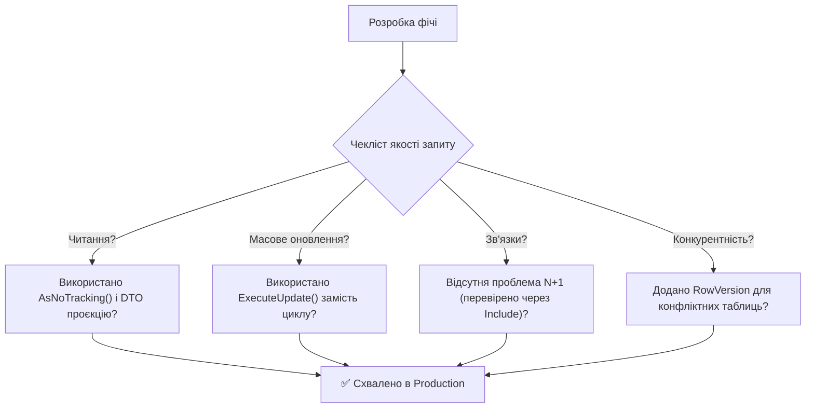

---
[⬅ Попередній слайд](#slide-24) • [⬆ До змісту](#toc) • [Початок презентації ➡](#slide-1)
