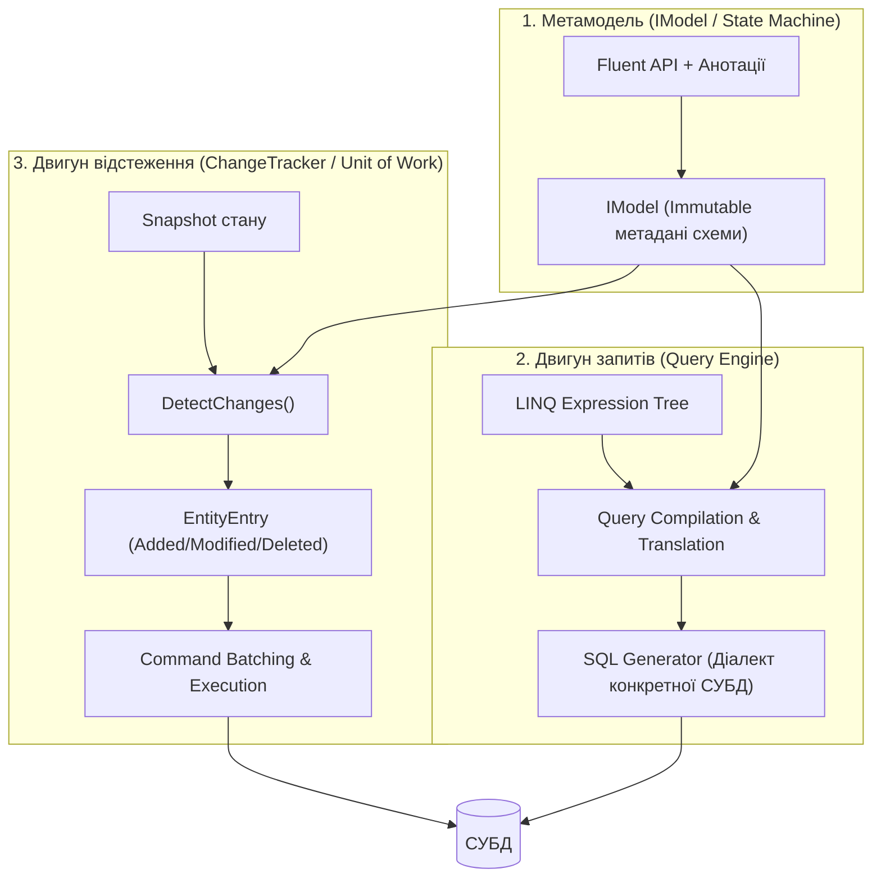
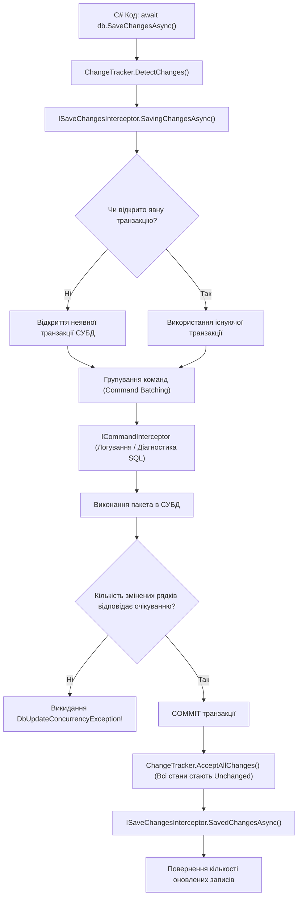
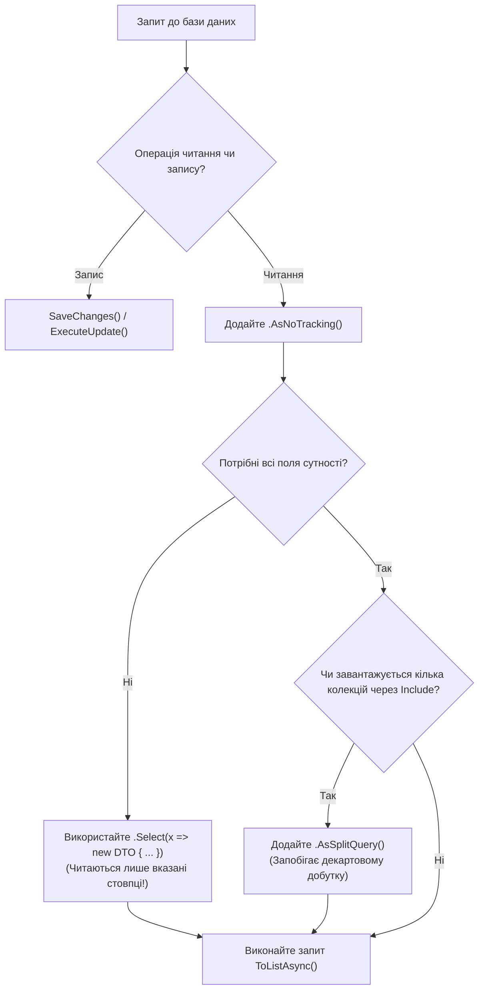

# 📘 Глибокий технічний довідник: Архітектура та патерни Entity Framework Core 10

> **Експрес-посібник та інженерна шпаргалка** для розробників.  
> Систематизує внутрішні механіки EF Core, ключові інтерфейси, конвеєр обробки запитів, життєвий цикл транзакцій та практичні CLI-команди.

---

## 📑 Зміст довідника

1. [Внутрішня архітектура EF Core: Як працює магія під капотом](#1-internal-architecture)
2. [Базові інтерфейси та абстракції: Анатомія та призначення](#2-core-interfaces)
3. [Конвеєр виконання запитів (Query Pipeline) та збереження (Save Pipeline)](#3-execution-pipelines)
4. [Шпаргалка консольних команд: `dotnet ef` CLI](#4-cli-cheatsheet)
5. [Організація зв'язків між сутностями: Довідник мапінгу](#5-relationships-reference)
6. [Стратегії оптимізації та Performance Best Practices](#6-performance-best-practices)
7. [Гібридна робота із сирим SQL та збереженими об'єктами](#7-raw-sql-hybrid)
8. [Конкурентність та обробка конфліктів даних](#8-concurrency-handling)

---

<a id="1-internal-architecture"></a>
## 1. Внутрішня архітектура EF Core: Як працює магія під капотом

EF Core не є простою обгорткою над `SqlConnection`. Це повнофункціональний компілятор виразів C# у реляційну алгебру SQL, що складається з трьох фундаментальних підсистем:



### 1.1 Метамодель (`IModel`)
При першому зверненні до `DbContext` у пам'яті застосунку одноразово будується незмінний граф метаданих (`IModel`). Він кешується для всього типу контексту і містить повну інформацію про таблиці, стовпці, індекси, обмеження та зовнішні ключі.

### 1.2 Двигун запитів (Query Translation Engine)
Коли ви пишете вираз на LINQ:
```csharp
var users = db.Users.Where(u => u.Salary > 3000).ToList();
```
C#-компілятор не виконує код усередині лямбди — він будує **дерево виразів (`Expression<Func<User, bool>>`)**. EF Core аналізує це дерево, звіряє його з `IModel` і транслює вузли дерева (`BinaryExpression`, `MemberExpression`) у відповідні реляційні конструкції (`WHERE [u].[Salary] > @p0`).

### 1.3 Відстеження змін (Change Tracking Engine)
За замовчуванням EF Core використовує **Snapshot Change Tracking**:
1. При вичитуванні рядка створюється два об'єкти: екземпляр класу для вашого коду і прихований знімок початкових значень (`OriginalValues`).
2. Перед викликом `SaveChanges()` викликається метод `ChangeTracker.DetectChanges()`. Він попарно порівнює поточні поля зі знімком.
3. Якщо змінено лише одне поле `Email`, статус сутності стає `EntityState.Modified`, а властивість `entry.Property(x => x.Email).IsModified` стає `true`.

---

<a id="2-core-interfaces"></a>
## 2. Базові інтерфейси та абстракції: Анатомія та призначення

| Інтерфейс / Клас | Призначення в архітектурі | Ключові методи / Властивості | Де подивитися в проєкті |
|---|---|---|---|
| **`DbContext`** | Координатор сесії, реалізація Unit of Work та репозиторіїв | `SaveChanges()`, `Set<T>()`, `Database`, `Entry<T>()` | [IntroductionContext.cs](../Chapter01_Introduction/IntroductionContext.cs) 📍 *(рядки 10–25)* |
| **`DbSet<T>`** | Типізована колекція сутностей, точка входу для LINQ-запитів | `Add()`, `Remove()`, `Find()`, `AsQueryable()` | [ModelsContext.cs](../Chapter03_Models/ModelsContext.cs) 📍 *(рядки 16–22)* |
| **`IEntityTypeConfiguration<T>`** | Ізольоване налаштування окремої сутності за межами `OnModelCreating` | `Configure(EntityTypeBuilder<T> builder)` | [CategoryConfiguration.cs](../Chapter03_Models/Configurations/CategoryConfiguration.cs) 📍 *(рядки 9–25)* |
| **`IQueryable<T>`** | Інтерфейс відкладеного запиту для виконання на стороні СУБД | `Expression`, `ElementType`, `Provider` | [QueryExecutionController.cs](../Chapter06_Queries/Controllers/QueryExecutionController.cs) 📍 *(рядки 25–40)* |
| **`IDesignTimeDbContextFactory<T>`** | Фабрика контексту для роботи CLI-інструментів (`dotnet ef`) без запуску хоста | `CreateDbContext(string[] args)` | Використовується tooling-механізмами |
| **`IExecutionStrategy`** | Механізм стійкості підключення та повторних спроб (Retry Policy) | `Execute<T>()`, `ExecuteAsync<T>()` | [ProvidersController.cs](../Chapter02_Providers/Controllers/ProvidersController.cs) 📍 *(рядки 95–115)* |
| **`ISaveChangesInterceptor`** | Перехоплювач збереження (аудит, автоматичне заповнення `UpdatedAt`) | `SavingChanges()`, `SavedChanges()` | Інтерцептори життєвого циклу |

---

<a id="3-execution-pipelines"></a>
## 3. Конвеєр виконання запитів (Query Pipeline) та збереження (Save Pipeline)

### 3.1 Принцип «Матрьошки» у конвеєрі збереження даних
Конвеєр виконання операцій у EF Core побудований за принципом перехоплювачів (Interceptors / Pipeline):



👉 **Пов'язаний код у проєкті:**
- [BulkOperationsController.cs](../Chapter06_Queries/Controllers/BulkOperationsController.cs) 📍 *(дивіться рядки 18–45 — обхід конвеєра SaveChanges заради швидкодії)*

---

<a id="4-cli-cheatsheet"></a>
## 4. Шпаргалка консольних команд: `dotnet ef` CLI

Для роботи з міграціями необхідний глобальний інструмент:
```bash
dotnet tool install --global dotnet-ef
```

### Матриця найважливіших команд розробника:
| Задача | Команда CLI | Параметри та коментар |
|---|---|---|
| **Створити міграцію** | `dotnet ef migrations add <Name>` | `--context <ContextName> -o <Path>` — створення файлу з дельтою схеми |
| **Застосувати міграції** | `dotnet ef database update` | Оновлює базу до найостаннішої міграції у збірці |
| **Відкотити до міграції** | `dotnet ef database update <Name>` | Відкочує схему назад до вказаної міграції зі збереженням даних |
| **Згенерувати чистий SQL** | `dotnet ef migrations script` | `dotnet ef migrations script Initial AddNewField -o update.sql` — ідеально для продакшн CI/CD |
| **Видалити останню міграцію** | `dotnet ef migrations remove` | Працює лише якщо міграція ще **не** була застосована до бази даних |
| **Перевірити стан** | `dotnet ef migrations list` | Показує список усіх застосованих та очікуваних міграцій |
| **Database First (Scaffolding)** | `dotnet ef dbcontext scaffold` | Генерує C# класи з наявної БД (`dotnet ef dbcontext scaffold "<connection>" Microsoft.EntityFrameworkCore.SqlServer`) |

👉 **Пов'язаний код у проєкті:**
- [README.md глави 1](../Chapter01_Introduction/README.md) 📍 *(дивіться рядки 30–38 — приклад реальних команд міграцій проєкту)*
- [ExistingDbContext.cs](../Chapter01_Introduction/ScaffoldedLike/ExistingDbContext.cs) 📍 *(дивіться рядки 10–30 — результат виконання команди scaffold)*

---

<a id="5-relationships-reference"></a>
## 5. Організація зв'язків між сутностями: Довідник мапінгу

### 5.1 One-to-Many (1:N)
Найпоширеніший зв'язок. Батьківський клас має колекцію `ICollection<Child>`, дочірній клас має скалярну навігацію `Parent` та поле `ParentId`.
```csharp
builder.Entity<Blog>()
    .HasMany(b => b.Posts)
    .WithOne(p => p.Blog)
    .HasForeignKey(p => p.BlogId)
    .OnDelete(DeleteBehavior.Cascade);
```
👉 [RelationshipsContext.cs](../Chapter04_Relationships/RelationshipsContext.cs) 📍 *(рядки 25–40)*

### 5.2 One-to-One (1:1)
Вимагає обов'язкового визначення **залежної сторони** (де саме зберігається колонка FK). Дочірня сторона отримує унікальний індекс на зовнішній ключ.
```csharp
builder.Entity<User>()
    .HasOne(u => u.Profile)
    .WithOne(p => p.User)
    .HasForeignKey<UserProfile>(p => p.UserId);
```
👉 [RelationshipsContext.cs](../Chapter04_Relationships/RelationshipsContext.cs) 📍 *(рядки 42–55)*

### 5.3 Many-to-Many (M:N)
В EF Core 7+ підтримується неявний мапінг. Якщо на стику потрібні дані (дата приєднання, оцінка тощо) — створюється явна проміжна сутність зі складеним первинним ключем:
```csharp
builder.Entity<Enrollment>()
    .HasKey(e => new { e.StudentId, e.CourseId });
```
👉 [RelationshipsContext.cs](../Chapter04_Relationships/RelationshipsContext.cs) 📍 *(рядки 58–75)*

### 5.4 Власні типи (Owned Types) проти Комплексних типів (Complex Types)
- **Owned Types (`OwnsOne`)**: Приховані сутності без власного ключа.
- **Complex Types (`ComplexProperty`)**: Повноцінні Value Objects в EF Core 8+. Не мають статусу сутностей, не можуть бути збережені в іншій таблиці окремо від власника.
```csharp
// Complex Type (EF Core 8+)
builder.Entity<Customer>().ComplexProperty(c => c.Address);
```
👉 [ComplexTypesController.cs](../Chapter04_Relationships/Controllers/ComplexTypesController.cs) 📍 *(рядки 20–45)*

---

<a id="6-performance-best-practices"></a>
## 6. Стратегії оптимізації та Performance Best Practices



### 6.1 `AsNoTracking()` для всіх GET-запитів
Зменшує використання пам'яті на 50–70% і прискорює матеріалізацію об'єктів у 2–3 рази.
👉 [TrackingController.cs](../Chapter06_Queries/Controllers/TrackingController.cs) 📍 *(рядки 20–40)*

### 6.2 Уникнення Декартового добутку (`AsSplitQuery`)
Коли в одному запиті використовується два `Include` на колекції:
```csharp
db.Orders.Include(o => o.Items).Include(o => o.ShipmentLogs).ToList();
```
SQL генерує перехресний `JOIN`, дублюючи рядки замовлення $N \times M$ разів! Метод `.AsSplitQuery()` розбиває запит на кілька швидких незалежних SQL-операторів, об'єднуючи їх у пам'яті за первинним ключем.

### 6.3 Масові операції без завантаження в пам'ять
Замість повільного циклу `foreach`:
```csharp
// ❌ Погано: викачує 10 000 об'єктів у пам'ять
foreach (var p in db.Products.Where(p => p.Stock == 0)) db.Products.Remove(p);
await db.SaveChangesAsync();

// ✅ Швидко: виконується 1 прямий DELETE в базі за 5 мс
await db.Products.Where(p => p.Stock == 0).ExecuteDeleteAsync();
```
👉 [BulkOperationsController.cs](../Chapter06_Queries/Controllers/BulkOperationsController.cs) 📍 *(рядки 25–48)*

---

<a id="7-raw-sql-hybrid"></a>
## 7. Гібридна робота із сирим SQL та збереженими об'єктами

### 7.1 Безпечний інтерпольований `FromSql`
EF Core автоматично параметризує інтерпольовані значення C#:
```csharp
// Абсолютно безпечно! Перетворюється у SELECT ... WHERE Price > @p0
var products = db.Products.FromSql($"SELECT * FROM Products WHERE Price > {minPrice}").ToList();
```
👉 [RawSqlController.cs](../Chapter07_Sql/Controllers/RawSqlController.cs) 📍 *(рядки 20–35)*

### 7.2 Мапінг функцій СУБД (Scalar / Table-Valued Functions)
Метод у C# оголошується без тіла, а EF Core підставляє його в SQL:
```csharp
[DbFunction("fn_CalculateDiscount", "dbo")]
public static decimal CalculateDiscount(decimal price, int percent) => throw new NotSupportedException();
```
Тепер функцію можна викликати прямо всередині LINQ:
```csharp
var result = db.Products
    .Select(p => new { p.Name, SalePrice = SqlContext.CalculateDiscount(p.Price, 20) })
    .ToList();
```
👉 [StoredFunctionsController.cs](../Chapter07_Sql/Controllers/StoredFunctionsController.cs) 📍 *(рядки 20–45)*

---

<a id="8-concurrency-handling"></a>
## 8. Конкурентність та обробка конфліктів даних

### 8.1 Токен паралелізму (`RowVersion`)
Для захисту від втрати оновлень (Lost Updates) додається стовпець версії:
```csharp
public class BankAccount
{
    public int Id { get; set; }
    public decimal Balance { get; set; }
    [Timestamp]
    public byte[] RowVersion { get; set; } = [];
}
```

### 8.2 Перехоплення та вирішення конфлікту
```csharp
try
{
    await db.SaveChangesAsync();
}
catch (DbUpdateConcurrencyException ex)
{
    var entry = ex.Entries.Single();
    var databaseValues = await entry.GetDatabaseValuesAsync();

    // Стратегія 1: База перемагає (відкидаємо зміни клієнта)
    entry.OriginalValues.SetValues(databaseValues);

    // Стратегія 2: Клієнт перемагає (перетираємо базу оновленою версією)
    // entry.OriginalValues.SetValues(databaseValues);
    // await db.SaveChangesAsync();
}
```
👉 [ConcurrencyController.cs](../Chapter08_Advanced/Controllers/ConcurrencyController.cs) 📍 *(рядки 45–125)*
